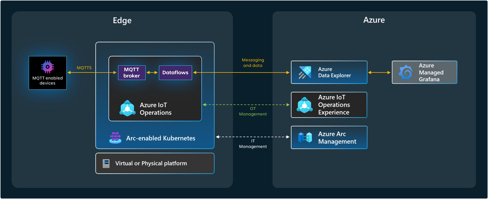

# Azure IoT Operations Workshop

This workshop is designed to help you understand and explore key features of Azure IoT Operations (AIO) and start building solutions that leverage these features. You will learn how to onboard devices, publish MQTT messages, ingest data on Azure Data Explorer and visualize data using dashboards.

## Scenario overview

In this workshop, you will simulate a scenario where you have a fleet of IoT devices that send telemetry data to an MQTT broker. You will use Azure IoT Operations to onboard these devices and publish messages to the broker. The telemetry data will be ingested into Azure Data Explorer using dataflows and visualized using dashboards.

## Prerequisites
- Azure IoT Operations version 0.7.31 deployed. You can setup a test environment by following the steps described in [Create a testing environment with AIO](./lab00-setup-aio/README.md) or you can follow the official [documentation](https://learn.microsoft.com/en-us/azure/iot-operations/quickstart-deploy-iot-operations?tabs=azure-cli).

## Labs

0. [Setup an AIO testing environment](./lab00-setup-aio/README.md) (you can bypass this one if you already have Azure IoT Operations ready)
1. [Onboard devices](./lab01-onboard-devices/README.md)
2. [Publish MQTT messages](./lab02-publish-mqtt/README.md)
3. [Ingest data on Azure Data Explorer using dataflows](./lab03-dataflow-adx/README.md)
4. [Use dataflows to transform and enrich messages](./lab04-transformations/README.md)
5. [Visualize data using dashboards](./lab05-data-dashboard/README.md)
