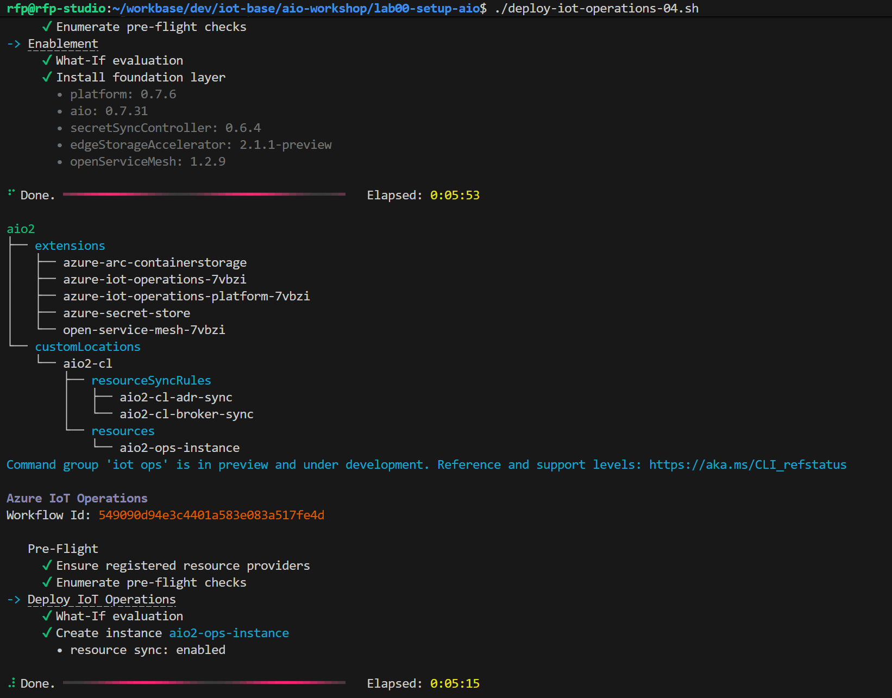
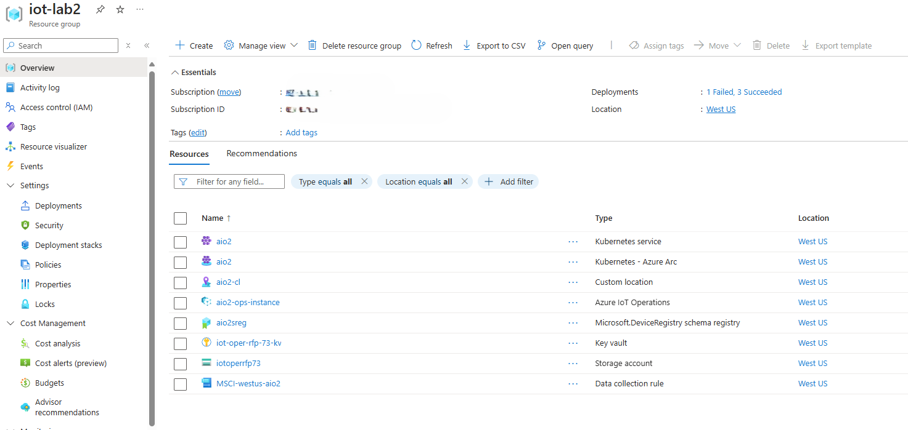

# Lab 00. Create a testing environment with AIO in cloud

If you need to create a testing environment using an AKS, arc-enabling AKS and then install Azure IoT Operations on it, you can use the scripts provided. Create a copy of the file `.env.template` with the name `.env`, customize the settings and then you can use the following scripts:

```bash
# Create AKS
./site-create-01.sh 

# Enable Arc on AKS and create pre-reqs like key vault, storage account and schema registry
./prep-iot-operations-setup-02.sh

# Deploy Azure IoT Operations
./deploy-iot-operations-03.sh
```

The last step can take several minutes to complete. In the end you shpould this kind of output:



After completing the deployment, you can list the created resources on the Azure portal:



And you can also check the resources created in K8s:

```bash
kubectl get all -n azure-iot-operations
```


## Troubleshooting

In case a VM SKU is not available, you can check what is available with the following command:

```bash
az vm list-skus --location westus --size Standard_D --all --output table
```
