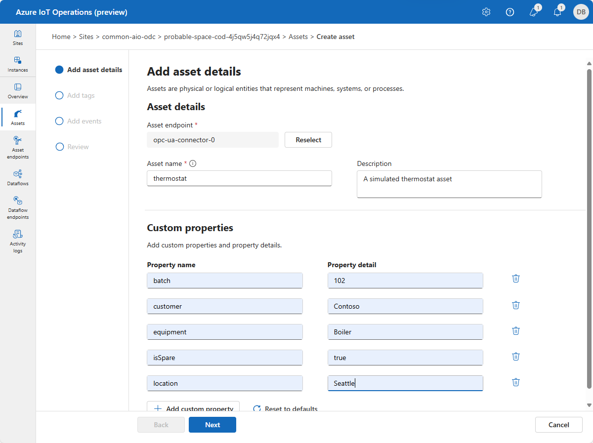
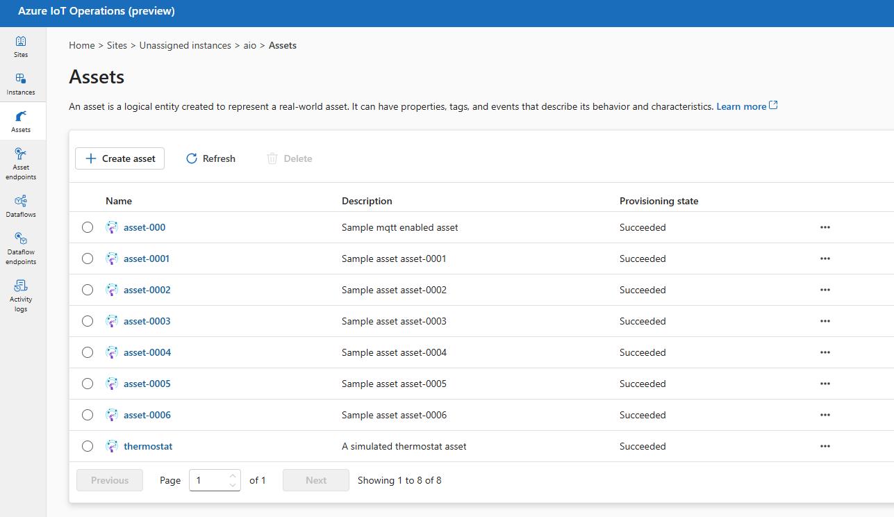
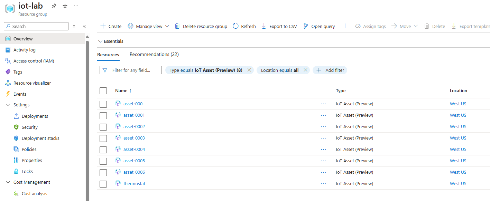
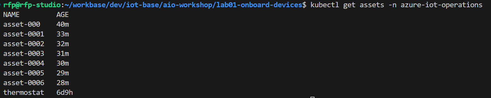

# Lab01. Onboard devices

This lab aims to onboard assets or devices into Azure IoT Operations. It is based on the [official documentation](https://learn.microsoft.com/en-us/azure/iot-operations/discover-manage-assets/overview-manage-assets).

Assets or devices can be created in many ways, and they are synchronized between Azure and Kubernetes:
- Using the IoT Operations Experience portal (UI experience).
- Using Azure CLI.
- Using Kubernetes resources.


## Create a device using the IOT Operations Experience portal

You can follow the instructions in the [Add Assets](https://learn.microsoft.com/en-us/azure/iot-operations/get-started-end-to-end-sample/quickstart-add-assets#sign-into-the-operations-experience) documentation but in a nutshell these are the steps:
- Open the [Azure IoT Operations Experience](https://iotoperations.azure.com) portal;
- Select your site and your AIO instance;
- Select the `Assets` option;
- Click on the `Create asset` button and fill in the required information.

    


You can check all the assets created in different places:
- Assets in the IoT Operations Experience portal:

    

- Azure resources that represent/project assets in the Azure Portal:

    

- Kubernetes resources synchronized with Azure:

    ```bash
    kubectl get asset -n azure-iot-operations
    ```

    


## Create a device using CLI

Besides using the portal, you can also use the Azure CLI to create assets. The provided script `create-lab-assets.sh` is an example on how to use the CLI. To use it, first you need to copy the provided `.env.template` file to a new file `.env` and customize it according to your environment.

```
resource_group="resource group name"
location="location name"
aio_instance="AIO instance name"
asset_endpoint_profile="Asset endpoint profile name"
```

After setting up the parameters, run the script to deploy the dataflow:

```bash
./create-lab-assets.sh
```

This asset is created with custom attributes and tags that are imported using the sample csv file `thermostat_tags.csv`.

You can check the created asset `asset-000` in the IoT Operations Experience, in the Azure Portal and in your Kubernetes environment, like described in the [previous section](#create-a-device-using-the-iot-operations-experience-portal).


## Create devices in bulk

This is an example on how you can onboard your devices in bulk. The provided script `bulk-create-lab-assets.sh` uses the file `assets.json` which is actually a list of assets to be created. To use it, first you need to copy the provided `.env.template` file to a new file `.env` and customize it according to your environment.

```
resource_group="resource group name"
location="location name"
aio_instance="AIO instance name"
asset_endpoint_profile="Asset endpoint profile name"
```

After setting up the parameters, run the script to deploy the dataflow:

```bash
./bulk-create-lab-assets.sh
```

You can check the created assets in the IoT Operations Experience, in the Azure Portal and in your Kubernetes environment, like described in the [previous section](#create-a-device-using-the-iot-operations-experience-portal).


## Create a device in Kubernetes

You can also create assets in Kubernetes using the `Asset` CRD. The provided file `asset-999.yaml` is an example of how to create an asset in Kubernetes:

```bash
kubectl apply -f asset-999.yaml
```

To check the created asset just use:

```bash
kubectl get asset -n azure-iot-operations
```
