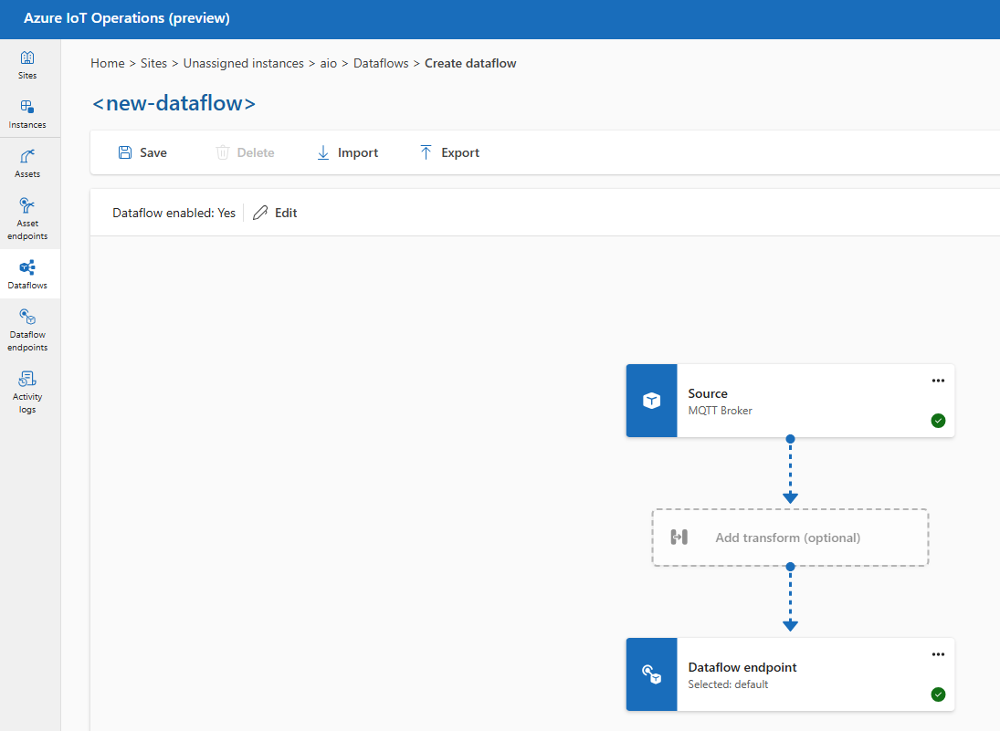

# Lab02. Publish MQTT messages

This lab aims to showcase how to use the Azure IoT Operations MQTT broker. It is based on the [official documentation](https://learn.microsoft.com/en-us/azure/iot-operations/manage-mqtt-broker/overview-iot-mq).


## Step 1. Check MQTT broker endpoints

The Azure IoT Operations MQTT broker is available at different endpoints depending on the listener configuration and from where the MQTT client wants to connect. In your Kubernetes cluster, you can find the broker endpoints in the `aio-broker` service:

```bash
kubectl get services -n azure-iot-operations
```


In this example the broker is both available internally (for MQTT clients running inside the K8S cluster) and externally. The internal endpoint is `aio-broker.azure-iot-operations.svc.cluster.local` and the external endpoint is `10.0.0.4`. The broker is listening on port `18883`.

## Step 2. Deploy MQTT client

To test publishing and subscribing messages, let's deploy a sample client pod:

```bash
kubectl create serviceaccount mqtt-client -n azure-iot-operations
kubectl apply -f mqtt-client.yaml
```

## Step 2. Publish messages

You can publish messages to the broker into any MQTT topic, e.g., `devices/xpto/temperature`. You can use the provided `mosquitto_pub` command to publish a message to the broker:

```bash
# Start a shell into the mqtt-client pod
kubectl exec --stdin --tty mqtt-client -n azure-iot-operations -- sh

# In the shell run the following command to publish a message (if using SAT auth)
mosquitto_pub -q 1 -t devices/xpto/temperature -d -V mqttv5 -m "{\"AssetId\":\"xpto-01\",\"Temperature\":55.3}" -i xpto-01 -h aio-broker -p 18883 --cafile /var/run/certs/ca.crt -D CONNECT authentication-method 'K8S-SAT' -D CONNECT authentication-data $(cat /var/run/secrets/tokens/broker-sat)

# Alternative if using x509 auth
mosquitto_pub -q 1 -t devices/xpto/temperature -d -V mqttv5 -m "{\"AssetId\":\"xpto-01\",\"Temperature\":55.3}" -i xpto-01 -h aio-broker -p 18883 --cert /tmp/foo.crt --key /tmp/foo.key --cafile /tmp/chain_server_client.pem
```


## Step 3. Subscribe messages

You can also subscribe to the topic to check if messages are being ingested correctly:

```bash
# Start a shell into the mqtt-client pod
kubectl exec --stdin --tty mqtt-client -n azure-iot-operations -- sh

# If using SAT auth
mosquitto_sub --host aio-broker --port 18883 --topic "devices/xpto/temperature" -v --debug --cafile /var/run/certs/ca.crt -D CONNECT authentication-method 'K8S-SAT' -D CONNECT authentication-data $(cat /var/run/secrets/tokens/broker-sat)

# Alternative if using x509 auth
mosquitto_sub -t devices/xpto/temperature -d -V mqttv5 -h aio-broker -p 18883 --cert /tmp/foo.crt --key /tmp/foo.key --cafile /tmp/chain_server_client.pem
```


## Step 4. Simple copy dataflow

Azure IoT Operations dataflows allow to use a MQTT broker and copy/transform messages from one topic to another. This can be done with any MQTT broker v5 or v3.1. Let's test it with the internal MQTT broker.

Go to the Azure IoT Operations portal and create a new dataflow.


Select the MQTT broker as the source using the topic `devices/xpto/temperature`.


Select the `default` MQTT broker as the target dataflow endpoint.


Choose a new topic for the target, e.g., `devices/xpto/temperature-copy`.


Save the new dataflow.



Give it a name, e.g., `simple-mq-copy` and description.


And save it again.


After being synchronized, the dataflow will start copying messages from the source to the target topic.


### Test the dataflow

You can test the dataflow by publishing a message to the source topic `devices/xpto/temperature` and checking if it is copied to the target topic `devices/xpto/temperature-copy`.

```bash
# Start a shell into the mqtt-client pod
kubectl exec --stdin --tty mqtt-client -n azure-iot-operations -- sh

# In the shell run the following command to publish a message (if using SAT auth)
mosquitto_pub -q 1 -t devices/xpto/temperature -d -V mqttv5 -m "{\"AssetId\":\"xpto-01\",\"Temperature\":55.3}" -i xpto-01 -h aio-broker -p 18883 --cafile /var/run/certs/ca.crt -D CONNECT authentication-method 'K8S-SAT' -D CONNECT authentication-data $(cat /var/run/secrets/tokens/broker-sat)

# Alternative if using x509 auth
mosquitto_pub -q 1 -t devices/xpto/temperature -d -V mqttv5 -m "{\"AssetId\":\"xpto-01\",\"Temperature\":55.3}" -i xpto-01 -h aio-broker -p 18883 --cert /tmp/foo.crt --key /tmp/foo.key --cafile /tmp/chain_server_client.pem
```

Subscribe the target topic `devices/xpto/temperature-copy` to check if the message was copied.

```bash
# Start a shell into the mqtt-client pod
kubectl exec --stdin --tty mqtt-client -n azure-iot-operations -- sh

# If using SAT auth
mosquitto_sub --host aio-broker --port 18883 --topic "devices/xpto/temperature-copy" -v --debug --cafile /var/run/certs/ca.crt -D CONNECT authentication-method 'K8S-SAT' -D CONNECT authentication-data $(cat /var/run/secrets/tokens/broker-sat)

# Alternative if using x509 auth
mosquitto_sub -t devices/xpto/temperature-copy -d -V mqttv5 -h aio-broker -p 18883 --cert /tmp/foo.crt --key /tmp/foo.key --cafile /tmp/chain_server_client.pem
```


If you check the logs of the AIO dataflow pod you can check that the `simple-mq-copy` dataflow is running and copying messages from the source to the target topic.

```bash
kubectl logs aio-dataflow-default-0 -n azure-iot-operations
```


