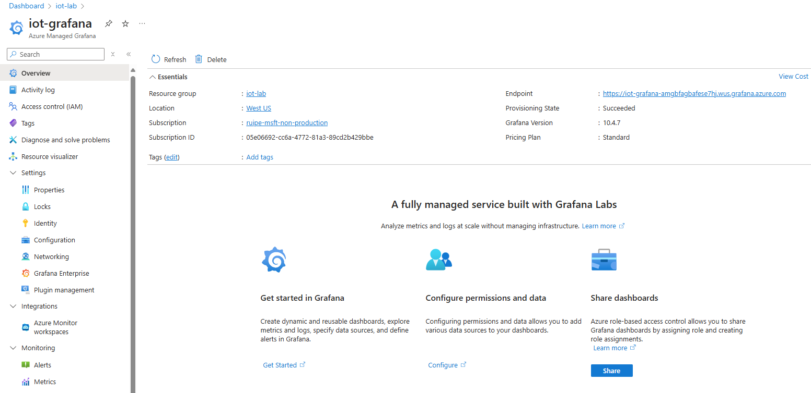
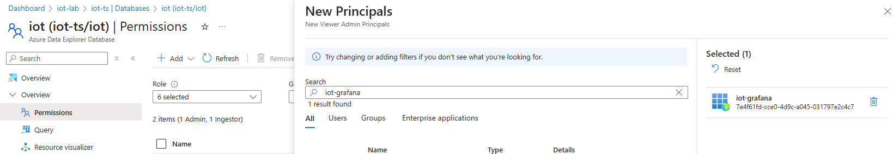
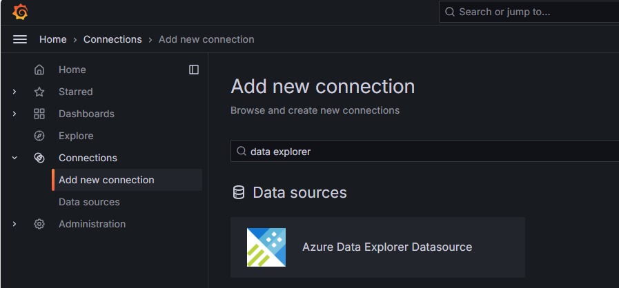
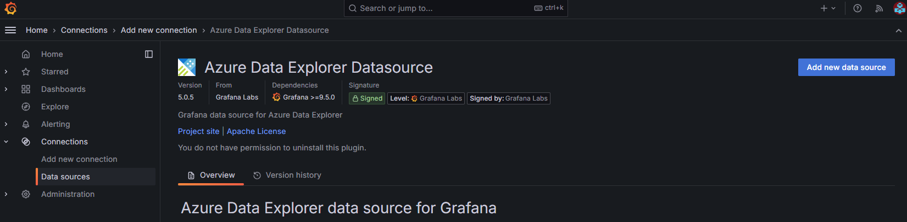
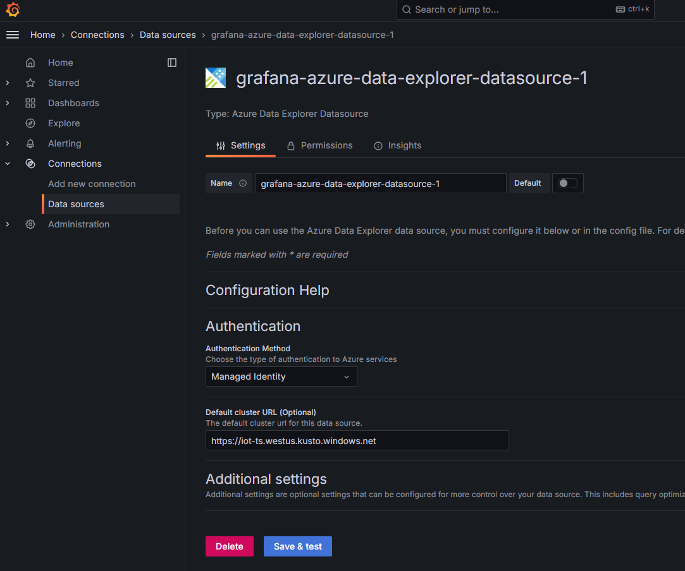
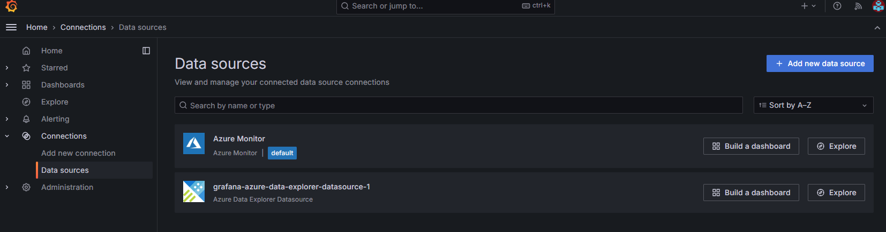
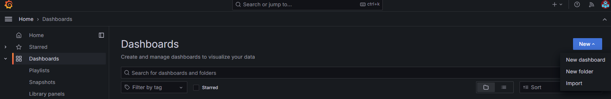
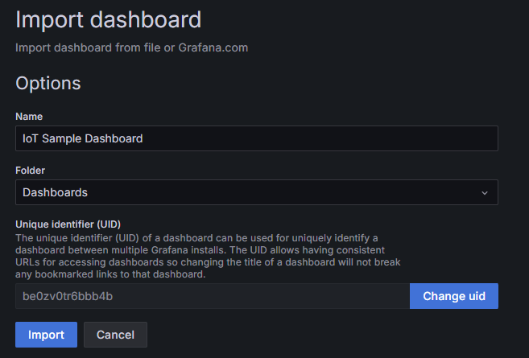
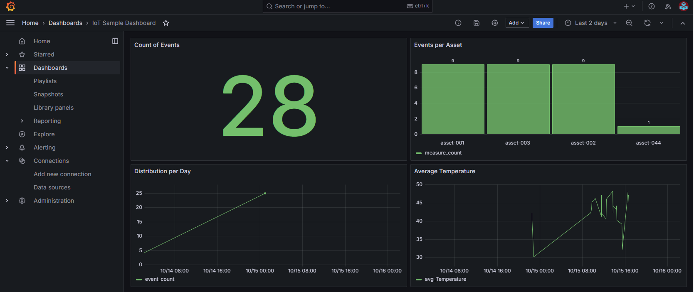
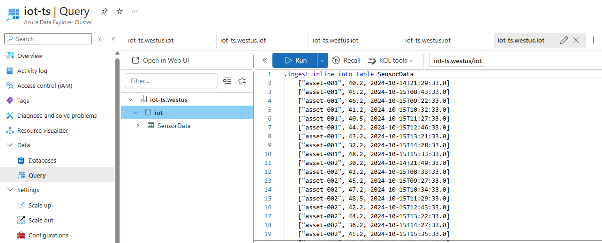

# Lab04. Visualize data using dashboards

This lab aims to configure a simple Grafana dashboard to visualize the data ingested into Azure Data Explorer (ADX). It is based on the [official documentation](https://learn.microsoft.com/en-us/azure/data-explorer/grafana?tabs=azure-managed-grafana).


## Step 1. Install Grafana

To create an Azure Managed Grafana workspace, just customize your environment and run the following command:

```bash
# Environment variables
export resourceGroup="iot-lab"
export mngGrafanaName="iot-grafana"
export location="westus"

# Deploy Grafana
az grafana create --name $mngGrafanaName --resource-group $resourceGroup --location $location --sku-tier Standard
```

In the end you have your Grafana workspace created, and you can access it through the Azure portal.




## Step 2. Configure Azure Data Explorer as a data source

### Set Grafana permissions on ADX

Managed Grafana creates a system-assigned managed identity for each new workspace, by default. You can use it to access your Azure Data Explorer cluster.

In the Azure Portal, navigate to your ADX database where AIO dataflow is ingesting data, e.g., `iot`, select Permissions and add the Grafana managed identity as a `Viewer`:




### Configure Azure Data Explorer as a data source

Go to your Managed Grafana workspace. Under Overview, select the Endpoint link to open the Grafana UI.

In Grafana, on the left menu, select Connections. Then select Add new connection and search for `data explorer`.



Select Azure Data Explorer.



Click Add new data source and fill in the following fields:
- Authentication Method: Managed Identity.
- Default cluster URL: The URL of your Azure Data Explorer cluster, e.g., `https://iot-ts.westus.kusto.windows.net`.



Click Save & test and you should have a new datasource ready to be used in your dashboards.




## Step 3. Create a simple dashboard

In Grafana, on the left menu, select Dashboards. Then select New and Import.



Choose the sample dashboard from file `grafana_dashboard.json` and click Load.



Import the dashboard and you should see the following:




## Populate test data in ADX (optional)

Go to your ADX query in the Azure Portal, paste the KQL command from file `messages.kql` and run it. It ingests some sample data that allows to better test the Grafana dashboard.




## Power BI alternative

Instead of using Grafana, you can use Power BI to visualize data from Azure Data Explorer. The following steps provided in the [official documentation](https://learn.microsoft.com/en-us/azure/data-explorer/power-bi-visualize-data) will guide you through the process of connecting Power BI to Azure Data Explorer and creating a simple report.
