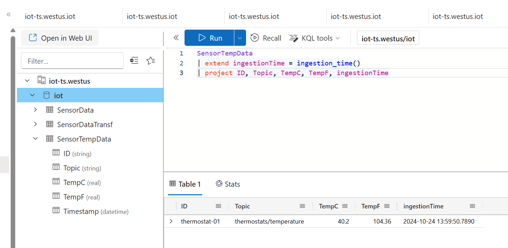

# Lab04. Use dataflows to transform and enrich messages

This lab aims to configure the Azure IoT Operations dataflow to ingest data into Azure Data Explorer (ADX) and perform some transformations in between. It is based on the [official documentation](https://learn.microsoft.com/en-us/azure/iot-operations/connect-to-cloud/concept-dataflow-mapping).


## Step 1. Create ADX database table

Let's assume that you already have ADX deployed, a database created, and AIO permissions to ingest, like described in the previous [Lab03. Ingest data on Azure Data Explorer using dataflows](../lab03-dataflow-adx/README.md). You can use the following KQL commands to create a new table to hold the ingested data:

```kql
.create table SensorTempData (
    ID: string,
    Topic: string,
    TempC: real,
    TempF: real,
    Timestamp: datetime
)
```

## Step 2. Configure dataflow

### Understand the dataflow

The provided file `calc-dataflow.bicep` implements several transformations to the original data ingested through MQTT.

1. The input data ingest in MQTT is expected to be in JSON format and the schema is defined as follows:

```json
{
    "AssetId": "thermostat-01",
    "Temperature": 40.2,
    "Timestamp": "2024-10-14T21:29:33.050631+00:00"
}
```

2. The target schema is defined in the `schema` section of the bicep file. It defines the structure of the egress data that will be sent to the ADX cluster.

```json	
{
  "$schema": "Delta/1.0",
  "type": "object",
  "properties": {
    "type": "struct",
    "fields": [
      { "name": "ID", "type": "string", "nullable": true, "metadata": {} },
      { "name": "Topic", "type": "string", "nullable": true, "metadata": {} },
      { "name": "TempC", "type": "double", "nullable": true, "metadata": {} },
      { "name": "TempF", "type": "double", "nullable": true, "metadata": {} },
      { "name": "Timestamp", "type": "string", "nullable": true, "metadata": {} }
    ]
  }
}
```

3. In the transformation we have 3 mappings with 2 changes in the name of the target field:

```json
{
    inputs: ['AssetId']
    output: 'ID'
}
{
    inputs: ['Temperature']
    output: 'TempC'
}
{
    inputs: ['Timestamp']
    output: 'Timestamp'
}   
```

4. We have 1 new field using the `topic` name from metadata:

```json
{
    inputs: ['$metadata.topic']
    output: 'Topic'
}
```

5. Finally, we have a calculation to convert the temperature from Celsius to Fahrenheit:

```json
{
    inputs: ['Temperature']
    output: 'TempF'
    expression: '($1 * 9/5) + 32'
}
```


### Configure and deploy the dataflow

The provided file `calc-dataflow.bicep` deploys all the necessary artifacts, namely:
- Message schema: that defines the structure of the egress data.
- ADX dataflow endpoint: that defines the connection to the ADX cluster.
- ADX dataflow: that defines the flow of data from the MQTT broker to the ADX cluster.

The bicep template can be deployed using the shell script `create-calc-dataflow.sh` that collects environment variables from a `.env` file. Copy the provided `.env.template` to a new file `.env` and customize it according to your environment.

```
resource_group="resource group name"
location="location name"
customLocationName="Custom location name"
schemaRegistryResourceGroup="Schema registry resource group name"
schemaRegistryName="Schema registry name"
aioInstanceName="AIO instance name"
mqttTopic="MQTT topic name"
adxClusterUri="ADX cluster URI (e.g., https://xpto.region.kusto.windows.net)"
adxDatabaseName="ADX database name, e.g., iot"
adxTableName="ADX database table name, e.g., SensorTempData"
```

After setting up the parameters, run the script to deploy the dataflow:

```bash
./create-calc-dataflow.sh
```

### Validate the deployment

You can check that you have the dataflow created by running the following command:

```bash
kubectl get dataflows -n azure-iot-operations
```

Also check for any errors in the deployment by validating the logs of the `aio-dataflow-operator-0` pod:

```bash
kubectl logs aio-dataflow-operator-0 -n azure-iot-operations
```

And finally, check if the dataflow is running correctly by validating the logs of the `aio-dataflow-default-0` pod:

```bash
kubectl logs aio-dataflow-default-0 -n azure-iot-operations -f
```

If there are no errors, you can start testing your new dataflow.


## Step 3. Test the dataflow

### Deploy MQTT client

To test publishing and subscribing messages, let's deploy a sample client pod:

```bash
kubectl create serviceaccount mqtt-client -n azure-iot-operations
kubectl apply -f ../lab02-publish-mqtt/mqtt-client.yaml
```

### Publish messages to the MQTT topic

For testing we need to ingest data into the MQTT topic `thermostats/temperature`. You can use the provided `mosquitto_pub` command to publish a message to the broker:

```bash
# Start a shell into the mqtt-client pod
kubectl exec --stdin --tty mqtt-client -n azure-iot-operations -- sh

# In the shell run the following command to publish a message (if using SAT auth)
mosquitto_pub -q 1 -t thermostats/temperature -d -V mqttv5 -m "{\"AssetId\":\"thermostat-01\",\"Temperature\":40.2,\"Timestamp\":\"2024-10-14T21:29:33.050631+00:00\"}" -i thermostat -h aio-broker -p 18883 --cafile /var/run/certs/ca.crt -D CONNECT authentication-method 'K8S-SAT' -D CONNECT authentication-data $(cat /var/run/secrets/tokens/broker-sat)

# Alternative if using x509 auth
mosquitto_pub -q 1 -t thermostats/temperature -d -V mqttv5 -m "{\"AssetId\":\"thermostat-01\",\"Temperature\":40.2,\"Timestamp\":\"2024-10-14T21:29:33.050631+00:00\"}" -i thermostat -h aio-broker -p 18883 --cert /tmp/foo.crt --key /tmp/foo.key --cafile /tmp/chain_server_client.pem
```

You can also subscribe to the topic to check if messages are being ingested correctly:

```bash
# If using SAT auth
mosquitto_sub --host aio-broker --port 18883 --topic "thermostats/temperature" -v --debug --cafile /var/run/certs/ca.crt -D CONNECT authentication-method 'K8S-SAT' -D CONNECT authentication-data $(cat /var/run/secrets/tokens/broker-sat)

# Alternative if using x509 auth
mosquitto_sub -t thermostats/temperature -d -V mqttv5 -h aio-broker -p 18883 --cert /tmp/foo.crt --key /tmp/foo.key --cafile /tmp/chain_server_client.pem
```

### Check the data in ADX

If everything is working fine, you should be able to see data being ingested on the ADX table. Use the following KQL query to check the data:

```kql
SensorTempData
| extend ingestionTime = ingestion_time()
| project AssetId, Topic, TempC, TempF, ingestionTime
```


